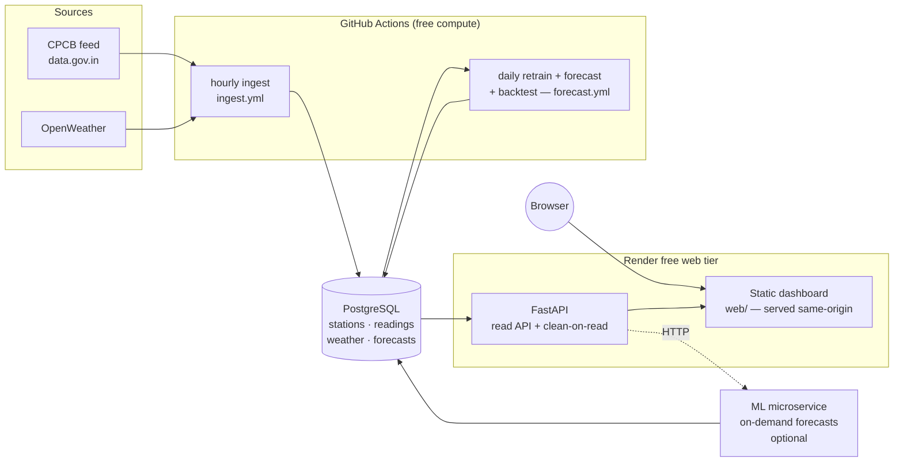

# AI-QI — Air Quality Intelligence

A full-stack air-quality forecaster platform for **Delhi**: it ingests live pollution readings
from India's official CPCB feed, cleans and stores them, forecasts the next 24 hours per
station with per-pollutant ML models, scores those forecasts against reality, and
serves everything through a web dashboard.

---

## Features

- **Ingest** — pulls Delhi's hourly readings (PM2.5, PM10, NO₂, SO₂, CO, O₃, NH₃)
  from the CPCB feed on [data.gov.in](https://data.gov.in), plus per-station weather
  from OpenWeather.
- **Clean on read** — validates against physical limits, removes statistical outliers,
  smooths, and optionally imputes gaps from a station's per-hour history (falling
  back to its nearest neighbour station).
- **Forecast** — one [Prophet](https://facebook.github.io/prophet/) model per
  `(station, pollutant)` with daily + weekly seasonality and Delhi-specific event
  regressors (Diwali firecracker spikes, farmer's stubble burning season) plus weather
  regressors (wind/temp/humidity). Produces a 24-hour forecast with uncertainty bands.
- **Score** — a backtest re-scores past forecasts against the readings that actually
  arrived, reporting MAE / RMSE / MAPE and uncertainty-band coverage.
- **Rank + advise** — computes each station's **overall CPCB AQI** (worst pollutant
  sub-index) and ranks stations worst-first, with a health advisory.

---

## Architecture at a glance

## Data model

- **`stations`** — one row per CPCB station: name (stable id), city, lat/lon.
- **`readings`** — *long* format, one row per `(station, pollutant, timestamp)`;
  mirrors the CPCB payload and is deduped by a unique constraint.
- **`weather`** — *wide* format, one row per snapshot: temp/humidity/pressure/wind/clouds;
  these become Prophet regressors.
- **`forecasts`** — one row per prediction: `target_time` (the hour forecast) plus
  `generated_at` (the vintage), so past forecasts can be scored.

The schema is entirely `CREATE ... IF NOT EXISTS` and self-applies on API startup.
Any empty Postgres works with no migration step.

### Forecasting locally

Prophet needs ~100 readings per series before a model is meaningful. At the current stage it's ingesting data and working passively.

---

## API

Read-only, JSON, same-origin with the dashboard. Interactive docs at `/docs`.

- **`GET /health`** — liveness + DB connectivity.
- **`GET /stations`** — all monitoring stations.
- **`GET /overview?pollutant=PM2.5`** — every station + its latest reading of one pollutant (map).
- **`GET /ranking`** — stations ranked by overall AQI, worst first.
- **`GET /stations/{id}/live`** — latest reading per pollutant.
- **`GET /stations/{id}/history?pollutant=&hours=&clean=&impute=`** — time series, optionally cleaned/imputed.
- **`GET /stations/{id}/forecast?pollutant=`** — latest stored 24h forecast.
- **`GET /stations/{id}/forecast/live?pollutant=`** — fresh forecast via the ML microservice.
- **`GET /stations/{id}/accuracy?pollutant=&hours=`** — MAE / RMSE / MAPE + band coverage.

## Tech stack

**[Backend]** FastAPI · psycopg 3 (async) · PostgreSQL 16 · httpx

**[ML]** Prophet · pandas

**[Frontend]** vanilla JS · hand-rolled SVG charts · Leaflet (with SVG fallback)

**[Infra]** Render (web) · GitHub Actions (ingest + forecast) · Docker (local DB)
