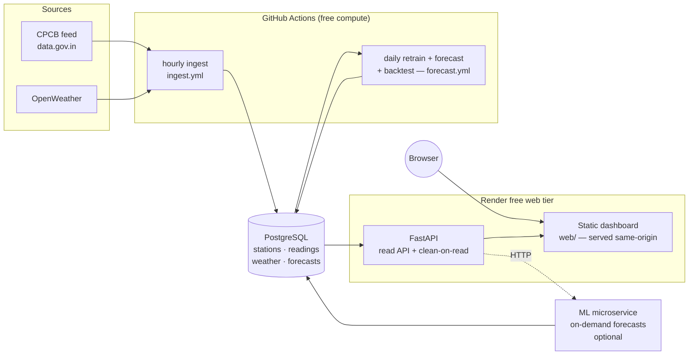

# AI-QI — Air Quality Intelligence

A full-stack air-quality platform for **Delhi**: it ingests live pollution readings
from India's CPCB feed, cleans and stores them, forecasts the next 24 hours per
station with per-pollutant ML models, scores those forecasts against reality, and
serves everything through a zero-dependency web dashboard.

Every moving part is built to run on **free tiers** — Render's free web service, a
bring-your-own free Postgres (Neon/Supabase), and GitHub Actions for the scheduled
(and memory-heavy) compute.

---

## What it does

- **Ingest** — pulls Delhi's hourly readings (PM2.5, PM10, NO₂, SO₂, CO, O₃, NH₃)
  from the CPCB feed on [data.gov.in](https://data.gov.in), plus per-station weather
  from OpenWeather. Idempotent, so it can run every hour without creating duplicates.
- **Clean on read** — validates against physical limits, removes statistical outliers,
  smooths, and optionally imputes gaps from a station's hour-of-day history (falling
  back to its nearest neighbour station).
- **Forecast** — one [Prophet](https://facebook.github.io/prophet/) model per
  `(station, pollutant)` with daily + weekly seasonality and Delhi-specific event
  regressors (**Diwali** firecracker spikes, **stubble-burning** season) plus weather
  regressors (wind/temp/humidity). Produces a 24-hour forecast with uncertainty bands.
- **Score** — a backtest re-scores past forecasts against the readings that actually
  arrived, reporting MAE / RMSE / MAPE and uncertainty-band coverage.
- **Rank + advise** — computes each station's **overall CPCB AQI** (worst pollutant
  sub-index) and ranks stations worst-first, with a health advisory.
- **Dashboard** — a vanilla-JS single page: a Leaflet map coloured by AQI category,
  station search, and hand-rolled SVG charts for history, forecast, and accuracy.

---

## Architecture at a glance



**Why the split:** the Render free web tier is capped at 512 MB, which the FastAPI +
psycopg serving stack fits comfortably — but Prophet/pandas training does not. So
training is decoupled: the daily retrain/forecast runs on a GitHub-hosted runner
(~16 GB) and writes forecasts into the DB; the web tier only ever *reads* them. The
hourly ingest runs as a GitHub Action too, because Render's free tier has no cron.

---

## Repository layout

```
db/
  schema.sql              # tables (self-applied on API boot), indexes
  migrations/             # e.g. TimescaleDB hypertable conversion
services/
  ingest/                 # CPCB + OpenWeather ingest jobs (idempotent upserts)
  api/                    # FastAPI read API, clean-on-read, AQI, serves web/
    aqi.py                #   CPCB sub-index + overall-AQI roll-up
    cleaning.py           #   validate / de-outlier / smooth / impute
    main.py               #   endpoints
  ml/                     # Prophet training, batch forecast, backtest, microservice
    train.py              #   per-(station,pollutant) model build/fit/forecast
    regressors.py         #   Diwali + stubble-burning drivers
    weather_features.py   #   weather regressors + climatology fill
    batch.py              #   trains every trainable series, writes 24h forecasts
    backtest.py           #   re-scores past forecasts -> accuracy
    service.py            #   optional on-demand forecast microservice
web/                      # zero-dependency dashboard (index.html, app.js, styles.css)
.github/workflows/
  ingest.yml              # hourly CPCB ingest -> deployed DB
  forecast.yml            # daily retrain + forecast + backtest -> deployed DB
render.yaml               # Render blueprint (web service only)
docker-compose.yml        # local Postgres 16
```

---

## Data model

| Table       | Shape | Purpose |
|-------------|-------|---------|
| `stations`  | one row per CPCB station | name (stable id), city, lat/lon |
| `readings`  | **long** — one row per `(station, pollutant, timestamp)` | mirrors the CPCB payload; deduped by a unique constraint |
| `weather`   | **wide** — one row per snapshot | temp/humidity/pressure/wind/clouds; becomes Prophet regressors |
| `forecasts` | one row per prediction | `target_time` (hour forecast) + `generated_at` (vintage) so past forecasts can be scored |

The schema is entirely `CREATE ... IF NOT EXISTS` and self-applies on API startup —
any empty Postgres works with no migration step.

---

## Getting started (local)

**Prerequisites:** Python 3.12, Docker (for local Postgres).

```bash
# 1. Start Postgres (applies db/schema.sql on first boot)
docker compose up -d

# 2. Configure secrets
cp .env.example .env
#    then fill in CPCB_API_KEY (data.gov.in) and, optionally, OPENWEATHER_API_KEY

# 3. Install + run the API (also serves the dashboard)
pip install -r services/api/requirements.txt
python -m services.api.run           # http://localhost:8000  (docs at /docs)

# 4. Pull some real data
pip install -r services/ingest/requirements.txt
python -m services.ingest.ingest     # Delhi readings
python -m services.ingest.weather    # weather (needs OPENWEATHER_API_KEY)
```

Open **http://localhost:8000** for the dashboard.

### Forecasting locally

Prophet needs ~100 readings per series before a model is meaningful. To try the ML
path immediately without waiting for hours of ingest, seed synthetic history:

```bash
pip install -r services/ml/requirements.txt
python -m services.ml.seed_synthetic   # synthetic seasonal history
python -m services.ml.batch            # train + write 24h forecasts
python -m services.ml.backtest         # score past forecasts -> /accuracy
```

The optional on-demand ML microservice (fresh forecasts over HTTP):

```bash
python -m services.ml.run              # http://localhost:8001
```

---

## API

Read-only, JSON, same-origin with the dashboard. Interactive docs at `/docs`.

| Endpoint | Description |
|----------|-------------|
| `GET /health` | liveness + DB connectivity |
| `GET /stations` | all monitoring stations |
| `GET /overview?pollutant=PM2.5` | every station + its latest reading of one pollutant (map) |
| `GET /ranking` | stations ranked by overall AQI, worst first |
| `GET /stations/{id}/live` | latest reading per pollutant |
| `GET /stations/{id}/history?pollutant=&hours=&clean=&impute=` | time series, optionally cleaned/imputed |
| `GET /stations/{id}/forecast?pollutant=` | latest stored 24h forecast |
| `GET /stations/{id}/forecast/live?pollutant=` | fresh forecast via the ML microservice |
| `GET /stations/{id}/accuracy?pollutant=&hours=` | MAE / RMSE / MAPE + band coverage |

---

## Deployment

The web service deploys from `render.yaml` (Render → New → Blueprint → connect repo).

1. **Bring a Postgres.** Render allows only one free Postgres per account, so the
   blueprint does **not** provision one — paste any free Postgres URL (Neon/Supabase,
   or an existing Render DB) as the `DATABASE_URL` secret. Use the external/pooled
   (SSL) URL. The app self-applies its schema on first boot.
2. **Set secrets** on the web service: `DATABASE_URL`, `CPCB_API_KEY`.
3. **Add repo secrets** for the scheduled jobs (Settings → Secrets → Actions):
   `DATABASE_URL` and `CPCB_API_KEY`. Then trigger `hourly-ingest` once manually
   (Actions tab → workflow_dispatch) to populate stations and the first readings.
4. `daily-forecast` retrains and writes forecasts every night once a series has
   accumulated ~100 hourly readings.

---

## Tech stack

**Backend** FastAPI · psycopg 3 (async) · PostgreSQL 16 · httpx
**ML** Prophet · pandas
**Frontend** vanilla JS · hand-rolled SVG charts · Leaflet (with SVG fallback)
**Infra** Render (web) · GitHub Actions (ingest + forecast) · Docker (local DB)

## Testing

```bash
pip install pytest
pytest services            # cleaning, scoring, regressors, weather-feature tests
```
